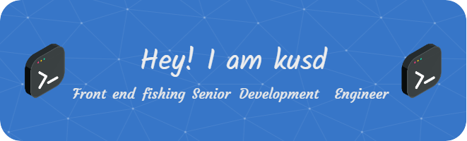

  

## Who Am I ?
&emsp;&emsp;I’m  **kusd** in University.  I plan to do some open-source projectes when I learn more.

<h3 align="left">Languages and Tools:</h3>

              

## About Github

&nbsp;

## Latest Blog Posts
<!-- BLOG-POST-LIST:START -->
<!-- BLOG-POST-LIST:END -->

## How to Reach Me

&emsp;

